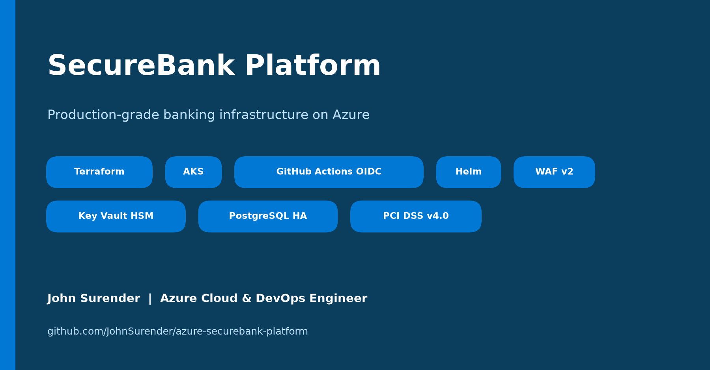
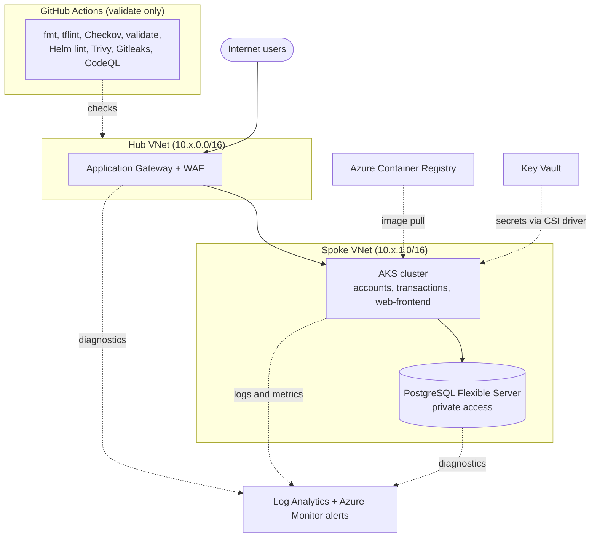
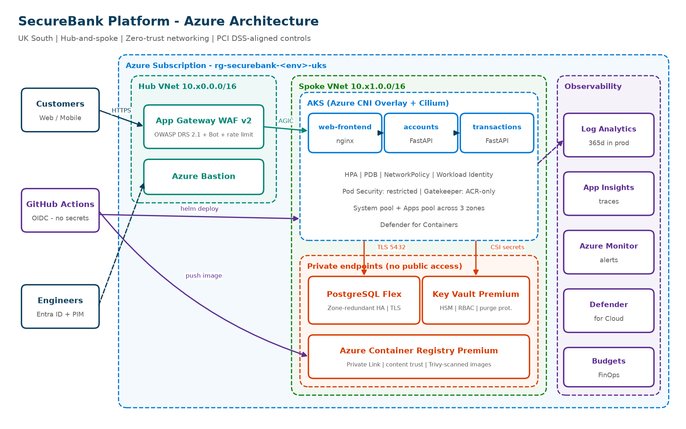
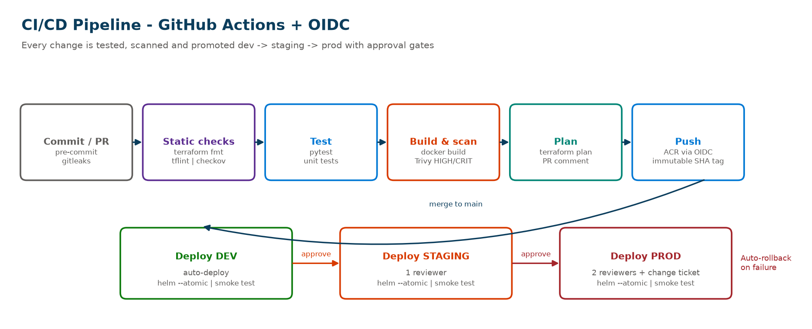

<p align="center">
  
</p>

# SecureBank Platform - Production-grade Banking Infrastructure on Azure

[](../../actions/workflows/terraform-plan.yml)
[](../../actions/workflows/app-ci-cd.yml)
[](../../actions/workflows/security-scan.yml)


A reference platform for a **UK retail-banking application** (accounts and money transfers) built the way a regulated bank would run it: Infrastructure-as-Code, zero-trust networking, secretless CI/CD, multi-environment promotion with approval gates, and controls mapped to **PCI DSS v4.0**.

> Portfolio project by **John Surender** - Azure Cloud & DevOps Engineer (AZ-104). No real customer data is used.

---

> **Reference architecture - not deployed.**
> This repository is a portfolio blueprint for a secure banking-style platform on Azure.
> It has been validated with `terraform fmt`, `tflint`, Checkov, `terraform validate`,
> Helm lint and Trivy scans, but has **not** been applied to a live Azure subscription.
> Security controls are aligned with PCI DSS-style requirements (for example, 365-day log
> retention in prod); this is not a certified or audited implementation.
> Deployment workflows are manual-only and need your own Azure subscription and OIDC setup
> (see `bootstrap/`).

## Architecture

## Architecture





| Layer | Service | Why |
|---|---|---|
| Edge | Application Gateway **WAF v2** (OWASP DRS 2.1, Bot Manager, rate limiting) | Block OWASP Top 10 and abusive traffic before it reaches the cluster |
| Compute | **AKS** - Azure CNI Overlay + Cilium, 3 availability zones, Azure Linux nodes | Scalable, zone-resilient microservices |
| Identity | Entra ID RBAC on AKS, **Workload Identity**, GitHub **OIDC** | No passwords, no long-lived secrets anywhere |
| Secrets | **Key Vault Premium** (HSM), Secrets Store CSI driver with rotation | Centralised, audited secret management |
| Data | **PostgreSQL Flexible Server** - zone-redundant HA, geo-backup, TLS enforced | Durable ledger storage, RPO under 5 min |
| Registry | **ACR Premium** with Private Link and content trust | Only signed, scanned images run |
| Network | Hub-and-spoke VNets, Private Endpoints, NSGs, default-deny NetworkPolicy | No data service is reachable from the internet |
| Observability | Log Analytics, App Insights, Container Insights, Defender for Cloud | Full audit trail (365-day retention in prod) |
| Governance | Azure Policy (tags, UK-only regions), Gatekeeper (ACR-only images), budgets | Guardrails enforced, not just documented |

More detail: [docs/architecture.md](docs/architecture.md) | [Network topology](docs/images/network-topology.png)

## CI/CD



- **PR:** fmt, tflint, Checkov, Gitleaks, CodeQL, pytest, Trivy image scan, then `terraform plan` posted as a PR comment for each environment.
- **Merge to main:** images pushed to ACR with immutable SHA tags, then promoted **dev (auto) -> staging (1 approver) -> prod (2 approvers)** via GitHub Environments.
- **Safe deploys:** `helm --atomic` auto-rolls back on failure; smoke tests gate every promotion.

## Repository layout

```
.
├── .github/                 # Workflows, CODEOWNERS, PR/issue templates, Dependabot
├── bootstrap/               # One-time scripts: remote state + GitHub OIDC federation
├── infra/
│   ├── modules/             # network, aks, acr, keyvault, postgres, appgw, monitoring
│   └── envs/                # dev / staging / prod (isolated state, own tfvars)
├── apps/
│   ├── accounts-service/    # FastAPI - accounts & balances
│   ├── transactions-service/# FastAPI - transfers with idempotency + AML limit
│   └── web-frontend/        # Hardened nginx static UI
├── deploy/
│   ├── helm/banking-service/# Reusable hardened chart (HPA, PDB, NetPol, CSI, WI)
│   └── k8s/base/            # Namespace (PSS restricted), default-deny, quotas
├── policies/                # Azure Policy + Gatekeeper constraints
├── monitoring/              # KQL queries + alert catalogue
├── scripts/                 # Smoke tests, dev teardown
└── docs/                    # Architecture, ADRs, runbooks, compliance, cost, images
```

## Quick start

```bash
# Run the whole stack locally
cp .env.example .env
make up            # accounts :8001, transactions :8002, web :8080
make test          # unit tests

# Deploy to Azure (full walkthrough in BUILD_GUIDE.md)
./bootstrap/01-create-tfstate.sh
GITHUB_REPO=JohnSurender/azure-securebank-platform ./bootstrap/02-setup-github-oidc.sh
make init plan apply ENV=dev
```

Try the API:

```bash
curl -s -X POST localhost:8001/accounts -H 'Content-Type: application/json' \
  -d '{"owner_name":"Ada Lovelace","opening_balance":"250.00"}'

curl -s -X POST localhost:8002/transfers -H 'Content-Type: application/json' \
  -H "Idempotency-Key: $(uuidgen)" \
  -d '{"from_account":"acc-1111","to_account":"acc-2222","amount":"42.50","reference":"RENT OCT"}'
```

## Environments

| | dev | staging | prod |
|---|---|---|---|
| Address space | 10.10/10.11 | 10.20/10.21 | 10.30/10.31 |
| AKS tier / app nodes | Free / 1-3 | Standard / 2-5 | Standard / 3-10 |
| PostgreSQL | Burstable, no HA | GP D2ds | GP D4ds, zone-redundant HA, geo-backup |
| WAF mode | Detection | Prevention | Prevention |
| Log retention | 30 d | 90 d | 365 d |
| Deploy gate | automatic | 1 approver | 2 approvers |

See [docs/environments.md](docs/environments.md) and [docs/cost-estimate.md](docs/cost-estimate.md).

## Security and compliance

Controls mapped to PCI DSS v4.0 requirements: [docs/security-compliance.md](docs/security-compliance.md).

## Decisions and operations

- ADRs: [AKS over App Service](docs/adr/0001-aks-over-app-service.md) | [Terraform module structure](docs/adr/0002-terraform-module-structure.md) | [OIDC over client secrets](docs/adr/0003-oidc-over-client-secrets.md)
- Runbooks: [Incident response](docs/runbooks/incident-response.md) | [DR failover](docs/runbooks/dr-failover.md)

## Roadmap

- [ ] Private AKS cluster + self-hosted runners in the spoke
- [ ] Azure Front Door Premium for multi-region active/passive (UK South + UK West)
- [ ] Image signing with Notation and admission verification (Ratify)
- [ ] Argo CD GitOps for application delivery
- [ ] Chaos Studio experiments for zone failure

## Author

**John Surender** - Azure Cloud & DevOps Engineer | AZ-104 | London, UK
[LinkedIn](https://www.linkedin.com/in/john-surender/) | [GitHub](https://github.com/JohnSurender)
