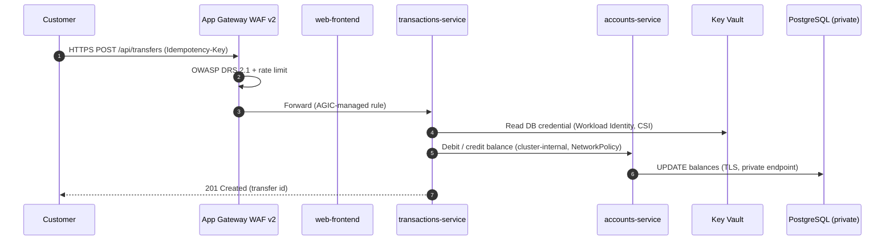
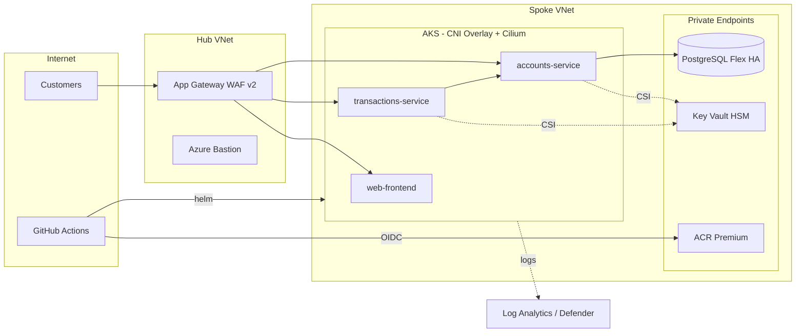

# Architecture

## Request flow

## Component view

## Design principles

1. **Zero trust** - every hop is authenticated (Entra ID / Workload Identity) and network-restricted (NSG + NetworkPolicy default-deny).
2. **No secrets in code or pipelines** - OIDC federation for CI, Key Vault for runtime.
3. **Everything as code** - infrastructure, policy, alerts, dashboards and deployment manifests are versioned and reviewed.
4. **Immutable, scanned artefacts** - images tagged by commit SHA, blocked on HIGH/CRITICAL CVEs.
5. **Blast-radius isolation** - separate resource groups, state files, VNets and approval gates per environment.
6. **Zone resilience** - AKS node pools, App Gateway, ACR and PostgreSQL HA span three availability zones.

## Resilience targets

| Tier | RTO | RPO | Mechanism |
|---|---|---|---|
| Zone failure | < 5 min | 0 | Zone-redundant AKS, App Gateway, PostgreSQL HA |
| Region failure | < 4 h | < 1 h | Geo-redundant DB backup restore to UK West + Terraform redeploy (see [DR runbook](runbooks/dr-failover.md)) |
| Bad deployment | < 5 min | 0 | `helm --atomic` rollback, `helm rollback` |
